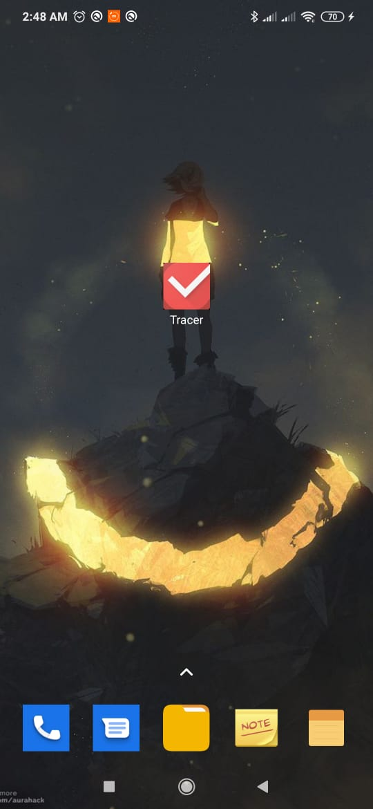
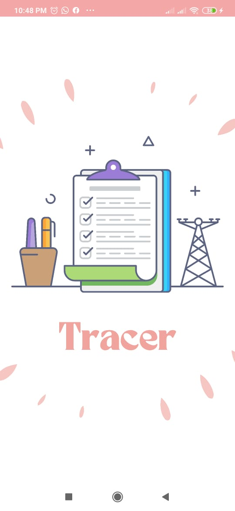
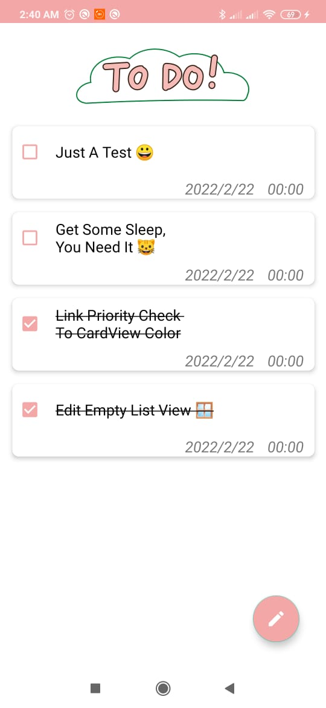
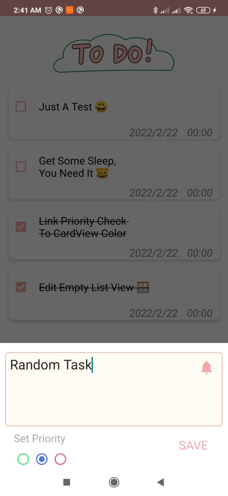
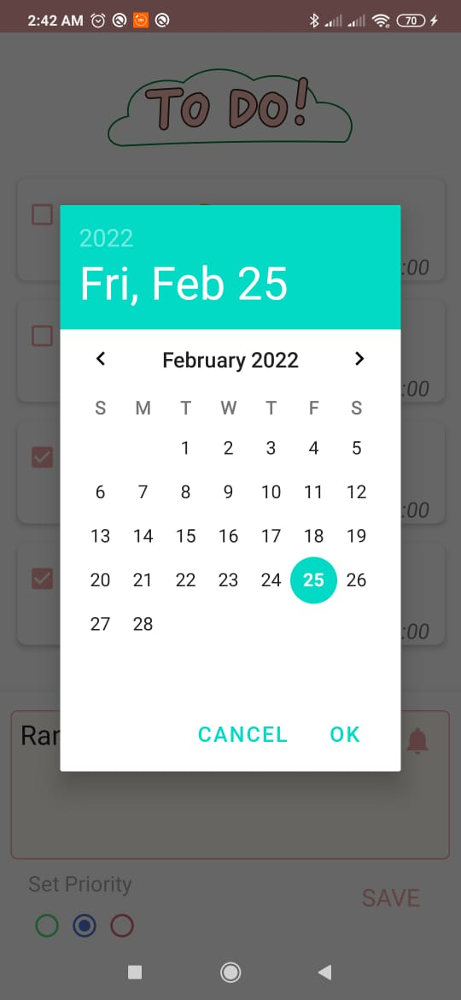
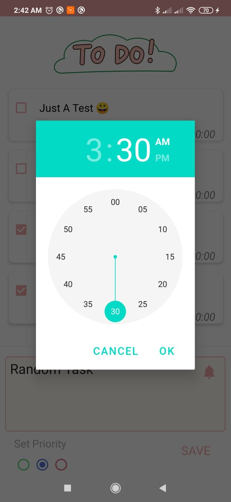
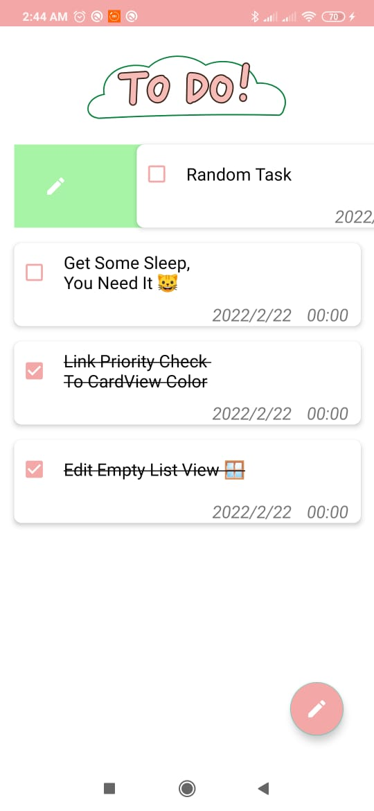
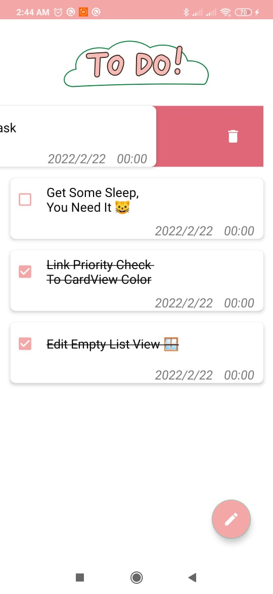

<h1 align="center">Tracer</h1>
<h4 align="center"> Simple ToDo List App with Java </h4>

    
     <a href="https://github.com/Mohamed-Shalaan/Tracer/blob/main/LICENSE">
        
    <a>
    
    
    
  
    
    

       
## :camera: Screenshots
       
<table width="100%">
  <tbody>
    <tr>
      <td width="1%"></td>
      <td width="1%"></td>
       <td width="1%"></td>
    </tr>
    <tr>
      <td width="1%"></td>
      <td width="1%"></td>
       <td width="1%"></td>
    </tr>
    <tr>
      <td width="1%"></td>
      <td width="1%"></td>
      <td width="1%"></td>
    </tr>
  </tbody>
</table>
       
       
## :u6307: About the Project
<h4 align="left"> Tracer was the end project of the ITI summer training camp on Android Mobile Development using Java (4 weeks), the app is an implementation of the sections studied throughout the course, with an elegant design that perseveres both simplicity and functionality  </h4> 
       
## :bookmark_tabs: Documentation
<h4> As per instruction, this is a simple <a href="md/MD97_ProjectReport.pdf">Documentation</a> containing an analysis of all the classes and librarians used to craft the app. </h4>
       
